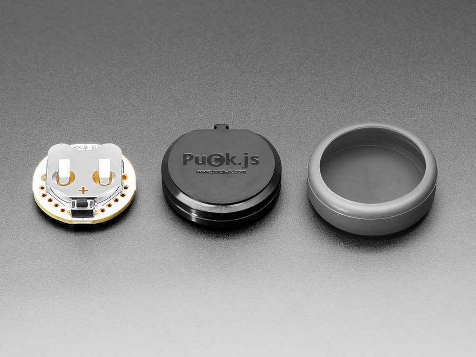
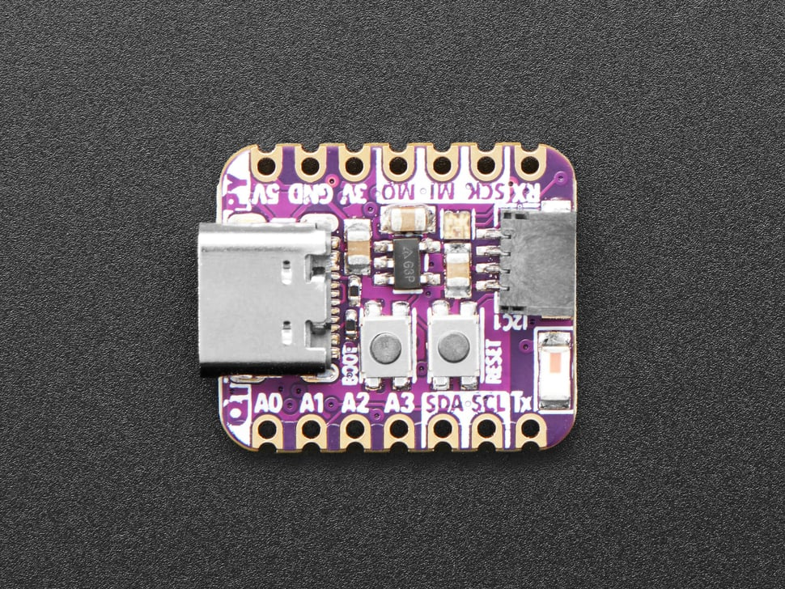

# puck-key

A [Puck.js](https://www.puck-js.com/) button that unlocks a
[SmartRent](https://smartrent.com/) apartment lock. Press the fob → an ESP32
receiver verifies it over BLE → the ESP32 calls the SmartRent cloud API to
unlock the door. Typical press-to-unlock is well under a couple of seconds.

<table align="center">
  <tr valign="middle">
    <td align="center"></td>
    <td align="center">&#10132;</td>
    <td align="center"></td>
    <td align="center">&#10132;</td>
    <td align="center"></td>
  </tr>
  <tr valign="middle">
    <td align="center"><b>Puck.js fob</b> button press</td>
    <td align="center">BLE rolling code</td>
    <td align="center"><b>ESP32 receiver</b> verify &amp; unlock</td>
    <td align="center">HTTPS unlock PATCH</td>
    <td align="center"><b>SmartRent</b> cloud API</td>
  </tr>
</table>

## How it works

- **Fob → receiver (BLE).** On a button press the fob connects and writes a
  32-byte time-based rolling code — `HMAC-SHA256(SECRET, floor(unixtime / 30))`.
  The receiver recomputes it (±1 window for clock skew) and only proceeds on a
  match, so a sniffed code expires in ~30–60 s. The receiver advertises
  anonymously (no name / service UUID) so a passive scan can't identify it.
- **Receiver → SmartRent (HTTPS).** The receiver logs in to SmartRent (handling
  TOTP 2FA), keeps the access token refreshed ahead of expiry, and holds a
  **pre-warmed TLS socket** so the unlock is just the request (~200 ms) rather
  than a fresh handshake.
- **Uptime heartbeat (optional).** The receiver can push a liveness ping to an
  [Uptime Kuma](https://github.com/louislam/uptime-kuma) monitor.

## Setup

### Receiver (ESP32)

Built for the **Adafruit QT Py ESP32 Pico** (8 MB flash, 2 MB PSRAM), using its
on-board NeoPixel as the status LED. Any ESP32 with a NeoPixel works; boards
without one just won't show LED status.

1. In the Arduino IDE, install the ESP32 core and select **Adafruit QT Py ESP32
   Pico** as the board. Install libraries: **NimBLE-Arduino** and **Adafruit
   NeoPixel**.
2. `cp receiver/secrets.h.example receiver/secrets.h` and fill in your values:
   - WiFi credentials.
   - SmartRent email/password.
   - `SR_HUB_ID` from `GET /api/v3/units` → `hub_id`, and `SR_DEVICE_ID` from
     `GET /api/v3/hubs/<hub>/devices` → your lock's `id`. SmartRent has no official
     public API; these endpoints are documented in [homebridge-smartrent](https://github.com/BitWise-0x/homebridge-smartrent/blob/main/src/lib/request.ts).
   - `SR_TFA_SECRET`: the base32 TOTP seed from SmartRent 2FA (leave the
     placeholder if 2FA is off).
   - `SECRET`: a high-entropy shared secret (also goes on the fob).
   - `HEARTBEAT_URL`: optional — comment it out to disable the heartbeat.
3. Flash `receiver/`. Note the `BLE address:` it prints on boot — the fob needs it.

### Fob (Puck.js)

1. Open the [Espruino Web IDE](https://www.espruino.com/ide/) and connect to the Puck.
2. `cp fob/provision.example.js fob/provision.js`, set `secret` (matching the
   receiver's `SECRET`) and `door` (the receiver's BLE address). Paste/run it once
   in the console — it also sets the Puck's clock.
3. Upload `fob/puck.js` as the saved program.

Press the button: the LED blinks green when the code is sent, red on a connection
failure.

## Security notes

- The rolling code is replay-resistant but not a substitute for building
  security — treat it as a convenience key for an already-secured entrance.
- The fob's clock drives the rolling code; if it drifts out of the window, re-run
  the `setTime(...)` line from provisioning, or widen `TOTP_WINDOW` on the receiver.
- `secrets.h` and `provision.js` are gitignored so no credentials are committed.

## References

- **SmartRent API endpoints** (unofficial) — enumerated in the
  [homebridge-smartrent](https://github.com/BitWise-0x/homebridge-smartrent)
  source: [`request.ts`](https://github.com/BitWise-0x/homebridge-smartrent/blob/main/src/lib/request.ts)
  (URLs) and [`api.ts`](https://github.com/BitWise-0x/homebridge-smartrent/blob/main/src/lib/api.ts)
  (unit/hub/device calls).
- [Espruino / Puck.js docs](https://www.espruino.com/Puck.js)
- [Adafruit QT Py ESP32 Pico](https://learn.adafruit.com/adafruit-qt-py-esp32-pico)
